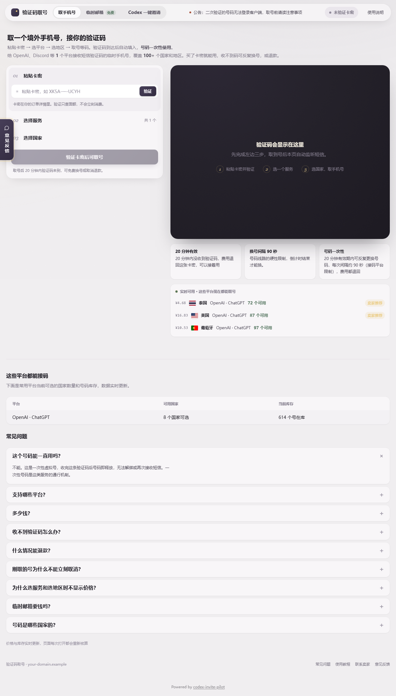
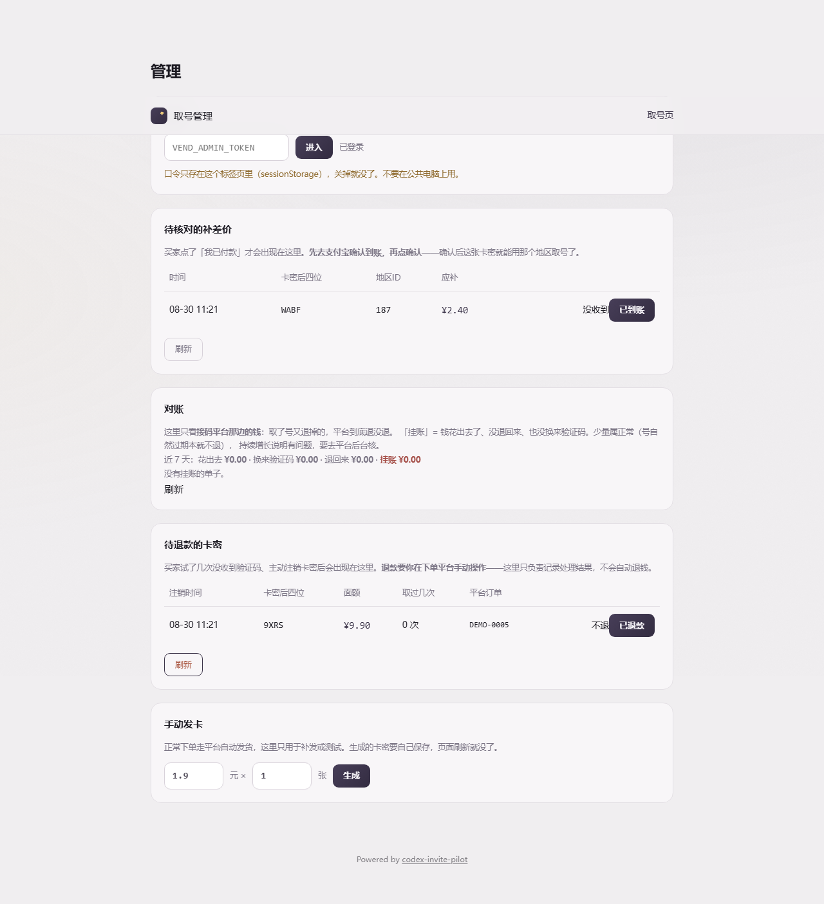

# codex-invite-pilot

> 一套**无人值守**的端到端自动履约链路：从收到一封信开始，到一个账号完成一次真实操作为止，中间没有人。
> Node.js + SQLite，358 项测试，正在生产环境运行。

[]()
[]()
[]()



---

## 目录

- [1. 项目发起人与运营信息](#1-项目发起人与运营信息)
  - [1.1 关于作者](#11-关于作者) · [1.2 自营业务](#12-自营业务) · [1.3 号源批发与上游合作](#13-号源批发与上游合作) · [1.4 商务合作与定制开发](#14-商务合作与定制开发) · [1.5 线上示例站](#15-线上示例站)
- [2. 这是什么](#2-这是什么)
- [3. 已知限制](#3-已知限制请先读这一节)
- [4. 系统结构 · 11 个板块](#4-系统结构--11-个板块)
- [5. 快速开始](#5-快速开始)
- [6. 部署](#6-部署)
- [7. 管理后台](#7-管理后台)
- [8. 架构与设计文档](#8-架构与设计文档)
- [9. 常见问题](#9-常见问题)
- [10. 贡献](#10-贡献)
- [11. 许可证与署名](#11-许可证与署名)
- [12. Star 历史](#12-star-历史)

---

## 1. 项目发起人与运营信息

### 1.1 关于作者

一个平凡的普通人。

这套系统不是练手项目，是我自己那门生意的完整源码——**它现在还在跑，还在收钱**。
所以文档里每一条"为什么这么做"，背后都有一次真实的损失，而不是一次思想实验。

### 1.2 自营业务

如果你只是想**用**，不想自己搭，下面这些是我自营的：

| 服务 | 在哪 |
|---|---|
| **Codex 一键邀请** | <https://sms.tempmail2026.xyz>（站内「Codex 一键邀请」标签页） |
| **ChatGPT / Claude 代充** | QQ 3087943900 |
| **成品号** | QQ 3087943900 |
| **临时邮箱**（自建，本仓库同款，可自部署） | <https://sms.tempmail2026.xyz> |
| **验证码取号** | <https://sms.tempmail2026.xyz> |

### 1.3 号源批发与上游合作

把系统搭起来之后你会发现，最大的成本不是代码，是**稳定的货源**。

我长期供应 Outlook 号（含 Graph 长效令牌号）、成品号与接码资源，支持批量与长期合作。
自己部署了这套系统、需要稳定进货的，直接找我。

📮 **QQ 3087943900**

### 1.4 商务合作与定制开发

- 独立站搭建 + GEO 优化
- 基于本系统的定制履约模块开发
- 私有化部署与技术支持

📮 **QQ 3087943900**

### 1.5 线上示例站

本仓库的参考部署：**<https://sms.tempmail2026.xyz>**

想看实际跑起来什么样，直接去示例站，比读文档快。

---

## 2. 这是什么

大多数自动化工具做的是"帮你少点几下鼠标"。这套系统做的是另一件事：

> **把一个需要人全程盯着的多步骤流程，交给机器独立完成，人不在场。**

具体到本项目的场景：一封邀请信到达邮箱之后，系统会自己完成建号、读取邮箱验证码、
处理手机验证、完成 OAuth 登录、驱动桌面客户端产生一次真实操作，
并**自己判断这一切到底成没成**——最后一步才是难点。

```
1  等信          读邮箱，每分钟心跳汇报信箱里实际有什么
2  建号          打开链接 → 邮箱验证码 → 资料页
2.5 保住登录态    这一步不关浏览器（关了下一步要从头再来）
3  起客户端      抓 OAuth 链接，确认本地回调监听已就绪
4  走 OAuth      密码屏 / 资料页 / 手机验证三个分支都在这
5  确认成立      挑战-应答：回复里必须出现只有真回答者才算得出的串
```

**为什么这条链路值得读**：它的每一步都依赖一个你无法控制、没有契约、随时会改版的外部界面。
在这种条件下让机器独立跑通，逼出来的是一套关于**"怎么知道自己做成了"**的方法——
那才是这个仓库真正的内容。

---

## 3. 已知限制（请先读这一节）

**我把它放在快速开始之前，因为不说清楚等于骗人。**

| 限制 | 状态 |
|---|---|
| **账号存活窗口** | ❌ **未解决。** 新建账号可能在较短时间内被服务方停用。这是本项目最大的开放问题，目前没有可靠解法，社区里同类项目也没有 |
| **依赖外部界面** | ⚠️ 链路依赖对方的注册与登录界面。**对方改版会导致失效，本项目不承诺跟随更新**（见 §11 维护说明） |
| **多任务并发** | ⚠️ 当前为单活跃任务串行消费。提高吞吐需要改排队 |
| **平台条款** | ⚠️ 使用前请自行阅读并遵守你所调用服务的用户条款。本项目按原样提供，作者不对使用后果负责 |

**这是一个生产系统在 2026-08 的快照。** 如果你期待的是一个开箱即用、长期跟版的成品，
这个项目不是。如果你想读的是一套在不可控环境里做无人值守自动化的完整实现——那正是它。

---

## 4. 系统结构 · 11 个板块

每个板块都有一篇独立文档，按同一套结构写：**一句话 → 为什么不能用显而易见的做法 → 踩过的坑 → 代码在哪。**
前三段不写代码，不懂编程也能读。

| # | 板块 | 一句话 | 文档 |
|---|---|---|---|
| 01 | **五阶段链路** | 从一封信到一次完成的操作，中间没有人 | [docs/01-五阶段链路.md](docs/01-五阶段链路.md) |
| 02 | **判据层** | 机器怎么知道自己这一步真的做成了 | [docs/02-判据层.md](docs/02-判据层.md) |
| 03 | **熔断与重试** | 怎么发现它卡住了——而不是等它烧完时间 | [docs/03-熔断与重试.md](docs/03-熔断与重试.md) |
| 04 | **号池** | 有一种库存，用一次就没了、补不回来 | [docs/04-号池.md](docs/04-号池.md) |
| 05 | **并发闸** | 独占资源上的四道锁 | [docs/05-并发闸.md](docs/05-并发闸.md) |
| 06 | **双机反向拉取** | 执行器一个入站端口都不开 | [docs/06-反向拉取.md](docs/06-反向拉取.md) |
| 07 | **邮箱臂** | 让机器有个自己的信箱 | [docs/07-邮箱臂.md](docs/07-邮箱臂.md) |
| 08 | **接码臂** | 让机器有个自己的手机号 | [docs/08-接码臂.md](docs/08-接码臂.md) |
| 09 | **发卡内核** | 卡密只是钥匙，真正的事在它之后 | [docs/09-发卡内核.md](docs/09-发卡内核.md) |
| 10 | **支付与验签** | 接错了不会报错，只会静默全失败 | [docs/10-支付与验签.md](docs/10-支付与验签.md) |
| 11 | **部署校验** | 判据落在产物上，不落在返回码上 | [docs/11-部署校验.md](docs/11-部署校验.md) |

📖 先读 [docs/00-总览.md](docs/00-总览.md)，一张图看懂全系统。
🎬 每个板块都有配套视频，索引见 [docs/videos.md](docs/videos.md)。

---

## 5. 快速开始

```bash
git clone https://github.com/openclaw-pza/codex-invite-pilot.git
cd codex-invite-pilot
npm install
cp .env.example .env      # 按注释填。全部留空也能起来（演示模式）
npm run vend              # 对外的售卖站
```

打开 <http://127.0.0.1:8788>：

| 页面 | 地址 |
|---|---|
| 买家页 | <http://127.0.0.1:8788/> |
| 卖家后台（发卡 / 补差价 / 退款 / 流水） | <http://127.0.0.1:8788/manage.html> |

**两个进程是故意分开的**，不是历史包袱：

```bash
npm run vend      # vend-server.js :8788  对外售卖站，只挂 public/vend/
npm start         # server.js      :8787  本机自用工具，只听回环
```

`npm start` 那个进程有能读写接码平台 key 的接口，**一行都不能暴露到公网**。
所以它的静态根目录是 `public/`，而对外那个锁死在 `public/vend/` ——
把两者合并的第一天就会有人把管理页挂到公网上。

首次启动自动建库、自动生成管理员口令并打印在终端。

```bash
npm test          # 358 项
```

**演示模式下**不调用任何外部付费服务，可以先把发卡、号池、后台整条走一遍，
再决定要不要接真实通道。

---

## 6. 部署

单机可跑。双机（队列在 A、执行器在 B）是给需要隔离执行环境的场景准备的，见
[docs/06-反向拉取.md](docs/06-反向拉取.md)。

部署脚本的校验**判据落在产物上**——看到这四条同时成立才算成功：

```
✅ 文件齐  ✅ 服务 active  ✅ 首页 200  ✅ 进程比文件新
```

> 最后一条是踩出来的：systemd 不会因为文件变了就重载。
> 部署脚本一路报成功，而线上跑的还是三小时前的代码。**"传上去了" ≠ "生效了"。**

---

## 7. 管理后台

不用 SSH：

- 发卡（面额 / 数量 / 服务锁 / 多码）
- 号池：批量粘贴导入、自定义分隔符、格式校验、行数徽章、**入库体检**、搜索
- 待处理充值与退款
- 账目流水与**风险敞口**（已收款但未完成履约的单子）



> 这两张图由 `npm run shots` 自动生成 —— 它自己起临时服务、自己造演示数据、截完自己清干净，**不碰任何真实数据库**。
> 界面改了就重跑一次，README 上的图不会过期。

> 入库体检为什么必须做：坏的凭据不体检，只会在真正用到它的时候才暴露——那时候已经晚了。
> 体检会真去换一次令牌**并真读一次数据**，只拿到令牌不算数。

---

## 8. 架构与设计文档

这是本仓库最值得读的部分。它们不是教程，是**事故复盘**。

**判据设计的四条规矩**，每一条背后都有一次真实损失：

1. **判据抽成纯函数，用真实抓到的原文钉测试。** 依赖界面文案的判据会随对方版本漂移，
   而且是**静默**漂移——不报错、不留日志，只是从某天起一直判错。
2. **判据落在产物上，不落在动作上。** 不问"这个按钮点成功了吗"，
   问"页面变了吗 / 文件写了吗 / 状态改了吗"。
3. **读不到 ≠ 成功。** 第三种结果叫 `unverifiable`，必须和"成功"分开处理。
   接口返回 200 也不代表事情办成了——对方服务端可能复核之后静默丢弃。
4. **失败分类偏保守。** 只有对方明确说"不可用"才判死；429 / 5xx / 没见过的错误码
   一律当瞬时故障重试。把瞬时故障判成永久失败，等于自己扔掉库存。

**熔断判据同样要落在产物上**：曾经有一轮空转 135 次、烧掉 7 分钟——
因为熔断计数器只在"点不到元素"时增长，而真实情况是每次都点得到、页面纹丝不动。
改成看**页面指纹连续 N 轮不变**才熔断。

完整文档见 [§4 的板块索引](#4-系统结构--11-个板块)。

---

## 9. 常见问题

**Q: 我部署了，账号很快就被停用了。**
A: 见 [§3 已知限制](#3-已知限制请先读这一节)。这是本项目最大的开放问题，目前没有解法。
如果你有思路，欢迎在 Discussions 里聊。

**Q: 对方改版了，能更新一下吗？**
A: 本项目不承诺跟随外部界面变更（见 §11）。判据模块都是纯函数 + 测试，
自己改比等我更新快——这也是当初这么设计的原因之一。

**Q: 必须两台服务器吗？**
A: 不必，单机可跑。

**Q: 能商用吗？**
A: 能。Apache-2.0。只要求保留署名，见 §11。

**Q: 需要哪些外部服务？**
A: 一个能收信的邮箱通道、一个接码通道、（可选）一个支付通道。
三个都是可替换的适配器，`.env.example` 里有说明。演示模式下一个都不需要。

**Q: 你自己在用吗？**
A: 在用，见 [§1.5 线上示例站](#15-线上示例站)。

---

## 10. 贡献

欢迎 PR。提之前请：

- `npm test` 全绿
- **新增判据类逻辑必须带真实原文的测试用例**，不接受只有 mock 的测试
- 一个 PR 只做一件事

**Issue 范围**（这样我才能保证响应质量）：

| 接受 | 不接受 |
|---|---|
| 代码 bug（带复现步骤） | 部署环境问题（Node 版本、系统差异） |
| 文档错误或不清楚的地方 | 账号可用性问题（见 §3） |
| 架构讨论、设计质疑 | "对方改版了求适配" |

---

## 11. 许可证与署名

**Apache License 2.0** —— 可以商用、可以修改、可以闭源分发。

两个要求：

1. 保留 `LICENSE` 和 `NOTICE`
2. **保留页面底部的项目署名链接**（默认已在 footer，配置项 `BRANDING_FOOTER`）

> 关于第 2 条：它可以关（`BRANDING_FOOTER=off`），**关了代码照常运行**——
> 我不在开源项目里埋暗桩。留着它是对作者的尊重，也是别人找到这套系统的唯一途径。

### 维护说明

本项目是一个生产系统在 **2026-08** 的快照。链路依赖外部服务方的界面，
**对方改版会导致失效，本项目不承诺跟随更新。**

这不是免责套话，是这类项目的固有性质——写清楚，比让你部署完才发现要好。
代码结构（判据纯函数 + 完整测试）就是照着"别人能自己改"设计的。

---

## 12. Star 历史

[](https://star-history.com/#openclaw-pza/codex-invite-pilot&Date)

如果这个项目对你有用，点个 star——这是它能被更多人看到的唯一途径。

---

<sub>本项目从一个真实运行的生意中抽取而来。文档里的每一条"为什么"，背后都有一次真实的损失。</sub>
