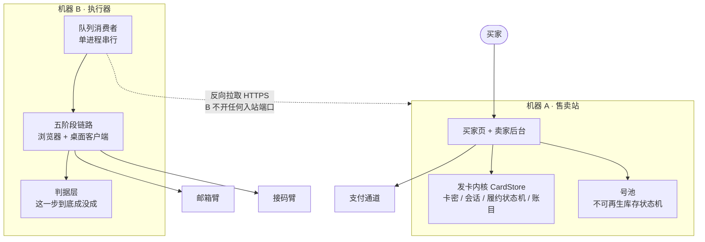

# 00 · 总览

> 一张图看懂全系统。

← [返回 README](../README.md)

---

## 这套系统在做什么

一句话：**把一个需要人全程盯着的多步骤流程，交给机器独立完成。**

它由两半组成，中间用一条队列连起来：

- **前半是卖东西**——发卡、验卡、算钱、退款、对账。这部分和普通发卡系统重合。
- **后半是把东西真的交出去**——而"交出去"不是吐一串卡密，是跑一段可能要几十分钟、
  依赖好几个外部系统、随时可能失败的流程。

大多数发卡系统只有前半。这个项目真正的内容在后半，以及**两半之间那条缝**——
钱已经收了、货还没交成，这段时间里的每一个状态都得有人管。

## 拓扑



**为什么执行器要反向去拉、而不是让售卖站推给它**：号池是本地数据库，
两台机器各 import 一次只会各自建一个空库。把队列钉在售卖站、让执行器当客户端之后，
执行器不用开任何入站端口，也不用为它改防火墙。详见 [06 反向拉取](06-反向拉取.md)。

## 一次完整的交易，从头到尾

```
买家验卡  →  分配一份库存（此刻一个字节都不碰它）
             ↓
        买家完成他那一步，回来点确认
             ↓
        进队列  →  执行器领走  →  五阶段链路开跑
                                    ↓
                        判据说成了 → 结算、回执
                        判据说没成 → 退回库存 + 退款工单
                        判据说不知道 → 既不结算也不退，等下一轮
```

最后那行是这套系统和"教程里的自动化"最大的区别：
**"不知道"必须能被表达出来**。只有成功/失败两种输出的系统，
一定会把"不知道"塞进其中一边，而塞进哪边都是错的。

## 11 个板块

按"从最值得读到最工程"排：

| # | 板块 | 一句话 |
|---|---|---|
| [01](01-五阶段链路.md) | 五阶段链路 | 从一封信到一次完成的操作，中间没有人 |
| [02](02-判据层.md) | **判据层** ★ | 机器怎么知道自己这一步真的做成了 |
| [03](03-熔断与重试.md) | 熔断与重试 | 怎么发现它卡住了——而不是等它烧完时间 |
| [04](04-号池.md) | 号池 | 有一种库存，用一次就没了、补不回来 |
| [05](05-并发闸.md) | 并发闸 | 独占资源上的四道锁 |
| [06](06-反向拉取.md) | 双机反向拉取 | 执行器一个入站端口都不开 |
| [07](07-邮箱臂.md) | 邮箱臂 | 让机器有个自己的信箱 |
| [08](08-接码臂.md) | 接码臂 | 让机器有个自己的手机号 |
| [09](09-发卡内核.md) | 发卡内核 | 卡密只是钥匙，真正的事在它之后 |
| [10](10-支付与验签.md) | 支付与验签 | 接错了不会报错，只会静默全失败 |
| [11](11-部署校验.md) | 部署校验 | 判据落在产物上，不落在返回码上 |

每个板块都有配套视频，索引见 [videos.md](videos.md)。

**只读一篇的话，读 [02 判据层](02-判据层.md)。** 它是整套系统里最贵的一部分，
也是最能迁移到别的项目上的一部分。

## 每篇的写法

四段固定结构，**前三段不写代码**：

1. **一句话** —— 这个板块解决什么问题
2. **为什么不能用显而易见的做法** —— 直觉做法是什么、为什么错
3. **踩过的坑** —— 带真实损失的复盘
4. **代码在哪** —— 文件、函数、测试

## 贯穿全系统的四条规矩

它们不属于某一个板块，是从每一次事故里反复长出来的同一件事：

1. **判据落在产物上，不落在动作上。** 不问"这一步执行成功了吗"，
   问"东西变了吗"。动作永远会"成功"，它只代表指令发出去了。
2. **读不到 ≠ 成功。** 任何 fail-open 的判据都有同一个特征：**故障越严重，越判成功**。
3. **失败分类偏保守。** 只有对方明确说不可用才判死。把瞬时故障判成永久失败，
   等于自己扔掉不可再生的库存。
4. **一个定义只能有一处。** 同一件事在两个地方各写一份判断，它们**必然**会漂移，
   而且漂移是静默的。

---

← [返回 README](../README.md)
